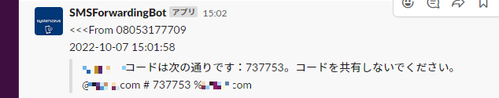

# SMS転送ボット

SMS認証が必要なクラウドにログインするときなどにSlackに認証コードを転送するボット

## デモ

bot<br>
```bash
$ python3 main.py --log-level debug
[2022/10/07 15:01:49.343][   DEBUG] Start...
⚡️ Bolt app is running!
[2022/10/07 15:02:20.26 ][   DEBUG] <<<From 08053177709
2022-10-07 15:01:58
>>>*** IDコードは次の通りです：737753。コードを共有しないでください。
@***.com # 737753 %***.com 
```

Slack<br>


## 必須ライブラリ

- pyserial==3.5b0
- psutil==5.8.0
- schedule==1.1.0
- slack-sdk==3.18.3
- slack-bolt==1.15.0
- gsm0338==1.0.0
- jinja2==2.11.3

## インストール方法

```bash
$ cd ~/
$ git clone https://github.com/SystemzeusInc/SMSForwardingBot.git
```

## セットアップ方法

### Slack App

1. Slack App作成  
    "Your Apps" > "Create New App" > "From scratch"  
    https://api.slack.com/apps?new_app=1

1. App-Level Tokensを追加  
    "Basic Information" > "App-Level Tokens" > "Generate Token and Scopes"で"**connections:write**", "**authorizations:read**"を追加

1. Socket Modeを有効化  
    "Socket Mode" > "Enable Socket Mode" ✅  

1. Slach Commandsを追加  
    "**/add_exclusion**", "**/delete_exclusion**", "**/get_exclusion**", "**/get_bot_info**"を追加  

1. Scopes追加  
    "OAuth & Permissions" > "Scopes"に"**app_mentions:read**", "**channels:history**", "**chat:write**", "**chat:write.customize**", "**commands**", "**group:history**"を追加

1. ワークスペースに再インストール  
    "OAuth & Permissions" > "OAuth Tokens for Your Workspace"の"Reinstall to Workspace"を押下

### Slackチャンネル

1. 目的のチャンネルにアプリを参加させる  
    チャンネルを左クリックし、"チャンネル詳細を表示する" > "インテグレーション" > "アプリを追加する"を選択し、先ほど作成したアプリを選択  

### Raspberry Pi

#### ボットの設定
1. ライブラリをインストール  
    ```bash
    $ pip install -r requirements.txt
    ```

1. Slack AppでBot,Appトークンを確認  
    Botトークン: "OAuth & Permissions" > "OAuth Tokens for Your Workspace" > "Bot User OAuth Token"  
    Appトークン: "Basic Information" > "App-Level Tokens" > "sms_forwarding_bot" > "Token"  

    取得したトークンをtoken.jsonとして以下のように保存。    

    ./token.json
    ```json
    {
      "bot_token": "xoxb-***",
      "app_token": "xapp-***"
    }
    ```

1. configの設定  
    config/config.iniのslack_channelを目的のチャンネルに設定  
    
    ./config/config.ini
    ```ini
    [setting]
    slack_channel = #sms_auth
    ```

#### USBモデムの設定

この設定でUSBドングル(モデム)がインターネットに接続できるようになる。

 1. ライブラリをインストール

    ```bash
    $ sudo apt update
    $ sudo apt install screen wvdial usb-modeswitch
    ```

1. デバイス(USB)のルールファイルを作成
   
    以下のファイルを作成
    /etc/udev/rules.d/30-soracom.rules
    ```text
    # AK-020
    ACTION=="add", ATTRS{idVendor}=="15eb", ATTRS{idProduct}=="a403", RUN+="/usr/sbin/usb_modeswitch --std-eject --default-vendor 0x15eb --default-product 0xa403 --target-vendor 0x15eb --target-product 0x7d0e"
    ACTION=="add", ATTRS{idvendor}=="15eb", ATTRS{idProduct}=="7d0e", RUN+="/sbin/modprobe usbserial vendor=0x15eb product=0x7d0e" 

    KERNEL=="ttyUSB*", ATTRS{../idVendor}=="15eb", ATTRS{../idProduct}=="7d0e", ATTRS{bNumEndpoints}=="03", ATTRS{bInterfaceNumber}=="02", SYMLINK+="modem", ENV{SYSTEMD_WANTS}="ifup@wwan0.service"
    ```

1. wvdialの設定

    以下のファイルを作成
    /etc/wvdial.conf ※docomoの場合  
    ```conf
    [Dialer Defaults]
    Init1 = AT+CFUN=1
    Init2 = ATZ
    Init3 = AT+CGDCONT=1,"IP","spmode.ne.jp"
    Dial Attempts = 0
    Stupid Mode = 1
    Modem Type = Analog Modem
    Dial Command = ATD
    Stupid Mode = yes
    Baud = 460800
    New PPPD = yes
    ISDN = 0
    APN = spmode.ne.jp
    Phone = *99***1#
    Username = spmode
    Password = spmode
    Carrier Check = no
    Auto DNS = 1
    Check Def Route = 1
    ```

    ※docomo以外の場合はAPN,Username,Passwordを使用するキャリアのものにしてください
    

#### 自動起動の設定を行う場合

この設定を行えば電源を入れるだけでこのボットが起動するようになる。

1. python実行スクリプトを作成

    以下のファイルを作成  

    /opt/sms_forwarding_bot.sh 

    ```bash
    #!/bin/bash

    sudo modprobe usbserial vendor=0x15eb product=0x7d0e 

    sleep 10
    cd /home/pi/SMSForwardingBot/src/
    python3 main.py
    ```

1. スクリプトを実行するサービスを登録
   
    以下のファイルを作成  

    /etc/systemd/system/sms_forwarding_bot.service
    ```conf
    [Unit]
    Description = SMS Forwarding Bot

    [Service]
    ExecStart = /opt/sms_forwarding_bot.sh
    Restart = always
    Type = simple

    [Install]
    WantedBy = multi-user.target
    ```

1. サービス起動

    ```bash
    $ sudo systemctl enable sms_forwarding_bot
    $ sudo systemctl start sms_forwarding_bot
    ```

## 使用方法

- ボット
      
    ```bash
    $ python3 main.py -h
    usage: main.py [-h] [--log-level {debug,info,warn,error,critical}] [--version]

    optional arguments:
      -h, --help            show this help message and exit
      --log-level {debug,info,warn,error,critical}
                            Set log level.
      --version             show program's version number and exit
    ```

    例)
    ```bash
    $ python3 main.py --log-level debug
    ```

- Slack(スラッシュコマンド一覧)

    - 除外リストに追加

        ```text
        /add_exclusion {対象の文字列} # ex) /add_exclusion NTT DOCOMO
        ```

    - 除外リストから削除

        ```text
        /delete_exclusion {対象の文字列} # ex) /delete_exclusion NTT DOCOMO
        ```
    
    - 除外リストを取得

        ```text
        /get_exclusion
        ```

    - ボットの情報を取得

        ```text
        /get_bot_info
        ```

## NOTE

ディレクトリ構成
```text
./
├ data/                    : 受信したSMSメッセージ
├ config/                  
│     ├ config.ini         : 設定ファイル
│     └ exclude_number.txt : 除外リスト
└ src/
      ├ util.py            : 共通ロジック
      ├ at.py              : ATコマンド
      ├ forwarding_task.py : 転送ロジック
      ├ sms_pdu.py         : PDUパース
      └ main.py            : メインスクリプト
```

## License

This projects is licensed under the MIT License, see the LICENSE.txt file for details.
